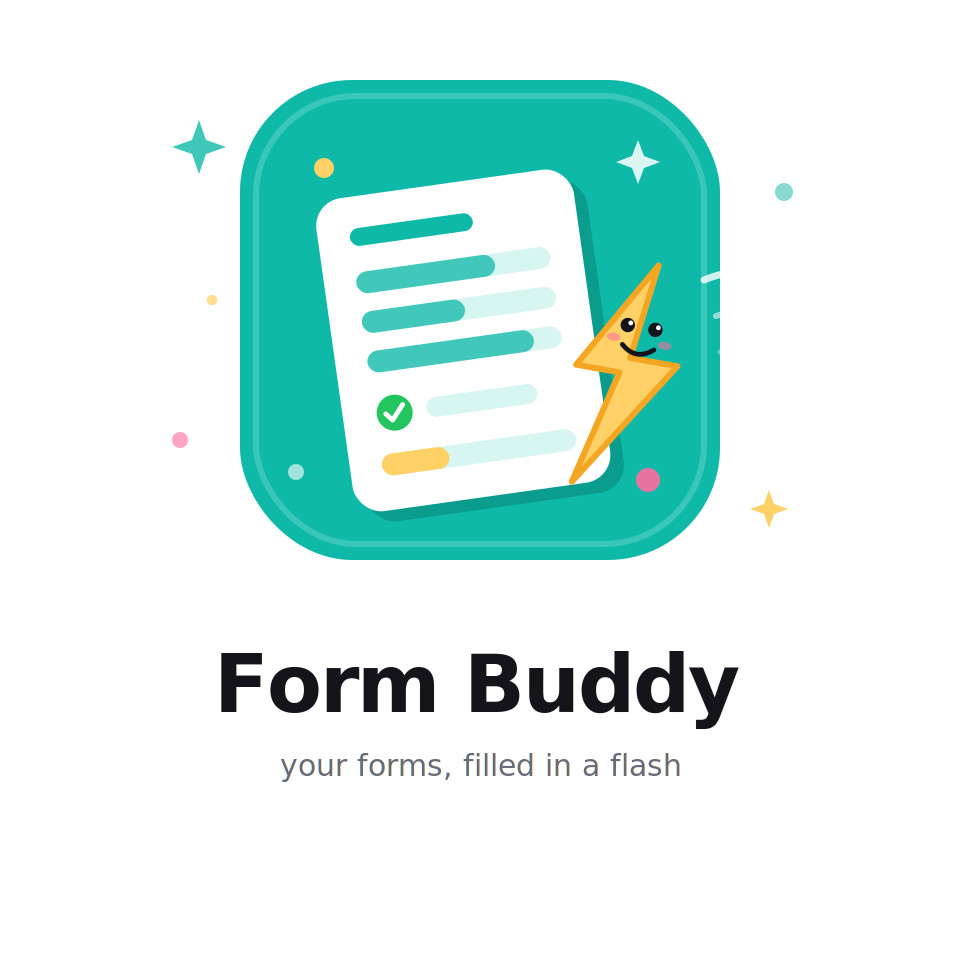

<div align="center">



# Form Buddy

**Your forms, filled in a flash.**

A Chrome extension that fills any web form from your saved profile, on any website, and gets smarter every time you use it. No account. No server. Your data never leaves your browser.

</div>

---

## Why Form Buddy

Registrations, government portals, visa applications, job applications, onboarding, checkout. We all type the same name, email and phone number dozens of times a week. Form Buddy stores your details once and fills them everywhere, learning each site's quirks as you go.

## Features

### One profile, every website
Save your fixed details (first name, last name, email, phone, city) once in the popup. Click **Autofill Page** on any form and Form Buddy matches and fills the fields for you.

### Custom fields for anything
Need to fill a passport number, GST number, company name or notice period over and over? Add a custom field with three things:

| Property | Example |
|---|---|
| Label | Passport Number |
| Value | P1234567 |
| Keywords | passport, document, id |

Any form field whose name, label or placeholder matches a keyword gets filled with your value. Your own keywords always take priority over the built-in matching rules.

### Smart matching engine
Form Buddy identifies fields by combining their `autocomplete`, `name`, `id`, placeholder and label text, then matches keywords against that. It works with text inputs, textareas, dropdowns, radio groups and checkboxes, and dispatches the right events so modern React, Vue and Angular forms register the values and run their validation.

### Per-site memory that survives redesigns
Correct a field once and Form Buddy remembers your answer for that site. On your next visit, remembered answers fill exactly, before any guessing. Memory is keyed by the field's label and name rather than its position in the page, so it keeps working even when a site changes its HTML. Radio and checkbox choices are remembered too.

### Fill groups
Two checkboxes in the Autofill tab let you choose what gets filled on a given page: your fixed fields, your custom fields, or both.

### History and daily stats
The History tab lists the sites you filled recently, with timestamps and field counts, and lets you clear a site's memory with one click (handy when you want a site to go back to your global profile). The Autofill tab shows how many fields and forms you completed today.

### Export and import
Back up your whole profile, including custom fields, to a single JSON file from the popup header, and restore it on any machine.

## Privacy

Form Buddy is local-first by design:

- All data lives in `chrome.storage.local` in your browser. Nothing is ever transmitted.
- Zero network calls. The extension has no backend, no analytics and no third-party scripts.
- Password fields are never filled, read or stored.
- Credit card fields are never stored.
- Page scripts cannot reach your data: the content script runs in Chrome's isolated world.
- Only the minimum permissions are requested: `storage`, `activeTab`, `scripting`.

## Installation

Until the Chrome Web Store listing is live, load the extension unpacked:

1. Clone this repository
   ```bash
   git clone https://github.com/parthkhatke/Form-Buddy.git
   ```
2. Open `chrome://extensions` in Chrome
3. Turn on **Developer mode** (top right)
4. Click **Load unpacked** and select the cloned folder
5. Pin Form Buddy to your toolbar

## Getting started

1. Click the Form Buddy icon and fill in your details on the **Profile** tab. Everything auto-saves as you type.
2. Add custom fields for anything you type often, with keywords that describe how forms usually label that field.
3. Open any web form, click the icon, switch to the **Autofill** tab and hit **Autofill Page**.
4. Fix anything it got wrong, once. Form Buddy remembers your correction for that site.

## Tech

| | |
|---|---|
| Platform | Chrome Extension, Manifest V3 |
| Language | Vanilla JavaScript (ES2020+), zero dependencies |
| Storage | `chrome.storage.local` |
| UI | Single popup, hand-written HTML/CSS, locally bundled fonts |
| Build step | None. The source is what runs. |

### Project structure

```
Form-Buddy/
├── manifest.json     Extension manifest (MV3)
├── popup.html        Popup UI (Profile / Autofill / History tabs)
├── popup.js          Popup logic, storage, messaging
├── content.js        Autofill engine + per-site learning
├── background.js     Service worker
├── fonts/            Space Grotesk + JetBrains Mono (bundled, no CDN)
└── icons/            Extension icons and logo
```

## Browser support

| Browser | Status |
|---|---|
| Chrome 88+ | Supported |
| Edge (Chromium) | Supported |
| Firefox / Safari | Not yet |

## License

Not yet licensed. All rights reserved for now.
